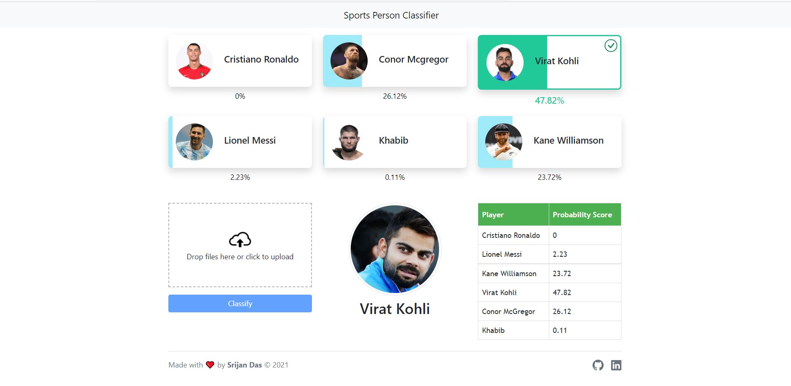

# Sports Person Image Classification

This projects can classify images of the following sports persons:

1. Cristiano Ronaldo
2. Lionel Messi
3. Conor McGregor
4. Khabib
5. Virat Kohli
6. Kane Williamson

## Demo

https://sports-person-classify.netlify.app/

## Screenshot



## Tech Stack

**Client:** HTML, CSS, JavaScript, Jquery, Bootstrap

**Server:** Python, Flask

## Run Locally

Clone the project

```bash
  git clone https://github.com/SrijanDas/Sports-person-image-classification.git
```

Go to the server directory

```bash
  cd Sports-person-image-classification\server\
```

Install dependencies

```bash
  pip install -r requirements.txt
```

Start the backend server

```bash
  python app.py
```

Now the backend server is running.
Open `frontend\index.html`.  
That's it 👍. You are ready to go.

## Roadmap

- Data Collection
- Data Cleaning
- Model Building, Training and Testing
- Backend API Building
- Frontend/UI Building
- Deployment

### Data Collection

Collected the images from google images with the help of [Fatkun Batch Download Image](https://chrome.google.com/webstore/detail/fatkun-batch-download-ima/nnjjahlikiabnchcpehcpkdeckfgnohf/RK%3D2/RS%3DPnB3CMxxSoOYRnLD3KKFviCVQvs-)

### Data Cleaning

Detected faces and eyes from the images with _[python-opencv](https://pypi.org/project/opencv-python/)_ and cropped only the faces. Then deleted the unwanted images manually. For more info refer to [Jupyter Notebook](https://github.com/SrijanDas/Sports-person-image-classification/blob/main/model/data_cleaning.ipynb)

### Model Building, Training and Testing

Tried different machine learning and deep learning models like SVM, Random Forest, Logistic Regression and CNN. Among those Logistic Regression and CNN gave the best accuray of 87.5% and 86.9% respectively. Finally selected the Logistic Regression model for deployment. For more info check this [Jupyter NoteBook](https://github.com/SrijanDas/Sports-person-image-classification/blob/main/model/classification.ipynb)

### Backend API Building

Build the backend api with python and flask. The backend has a root `/` url and a `/classify_image` url

```http
  POST /classify_image/
```

| Parameter    | Type     | Description                             |
| :----------- | :------- | :-------------------------------------- |
| `image_data` | `string` | **Required**. Your base64 encoded image |

### Frontend/UI Building

The frontend was built with HTML, CSS, Javascript, Jquery, Bootstrap.

### Deployment

- Backend API was deployed on **_heroku_**
- Fronted was deployed on **_netlify_**

## Thank you 😃

[](https://srijan-das.web.app/)
[](https://www.linkedin.com/in/srijan-das-3591791b3)
[](https://twitter.com/Srijan_1805)
